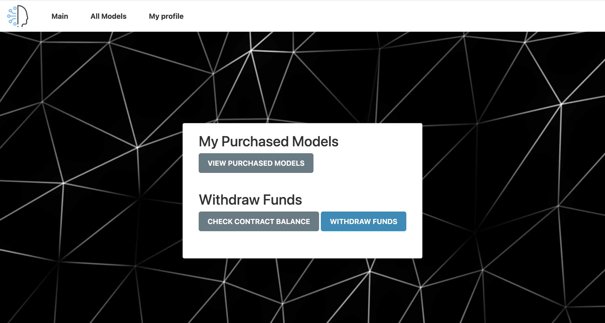

# AI Model Marketplace dApp

## Project Description

AI Model Marketplace is a decentralized application (dApp) that revolutionizes the way AI models are shared, purchased, and rated. Built on blockchain technology, this platform allows developers to list their AI models, while users can explore, purchase, and provide feedback on these models in a secure and transparent environment.

Key features:
- List AI models with detailed descriptions and pricing
- Browse and purchase available AI models
- Rate and review purchased models
- Secure transactions using smart contracts
- Transparent model ownership and usage rights

## Technologies Used

- Solidity (Smart Contract)
- Web3.js (Blockchain Interaction)
- Express.js (Backend Server)
- HTML/CSS/JavaScript (Frontend)
- MetaMask (Wallet Integration)
- Ganache (Local Blockchain for Development)
- Remix IDE (Smart Contract Development and Deployment)

## Prerequisites

Before you begin, ensure you have the following installed:
- Node.js and npm
- Ganache (for local development) or access to a testnet (e.g., Sepolia)
- MetaMask browser extension
- Remix IDE (web browser version is sufficient)

## Setup and Installation

1. Clone the repository:
git clone https://github.com/yourusername/ai-model-marketplace.git
cd ai-model-marketplace

2. Install dependencies:
npm install
npm install -g http-server nodemon

3. Deploy the smart contract:
- Copy the contract code from `AIModelMarketplace.sol` and paste it into Remix IDE.
- Compile the contract in Remix.
- Deploy the contract using Remix, connected to your chosen network (Ganache or testnet).
- Copy the deployed contract address and ABI.

4. Configure the dApp:
- Open `blockchain.js` in the `public` folder.
- Replace `contractAddress` with your deployed contract address.
- Replace `contractABI` with the ABI of your deployed contract.

5. Start the application: nodemon public/app.js

6. Access the dApp at `http://localhost:3000`

## Usage Instructions

1. Ensure MetaMask is connected to the correct network (Ganache for local development or your chosen testnet).
2. If using a testnet, make sure you have sufficient test ETH in your MetaMask wallet.
3. Navigate through the dApp using the intuitive interface:
- List a new AI model by providing details and setting a price.
- Browse available models in the marketplace.
- Purchase models that interest you.
- Rate and review models you've purchased.

## Screenshots
### Main Page

*This is the screen you see when you launch the project. It features a dynamic video background with the marketplace title.*

### Welcome Section

*When you scroll down on the main page, you'll find a welcoming introduction to the AI Model Marketplace and its features.*

### Models Page

*The models.html page is where users can list a new AI model, make purchases, and view detailed information about existing models.*

### User Profile

*In the profile section, users can view their purchased models, rate them, check the contract balance, and withdraw funds.*

## Examples of Interaction

1. Listing a Model:
- Click on "List a New AI Model"
- Fill in the model name, description, and price
- Click "List Model" and confirm the transaction in MetaMask

2. Purchasing a Model:
- Browse the available models
- Click "Purchase" on a model you're interested in
- Confirm the transaction in MetaMask

3. Rating a Model:
- Go to your purchased models
- Select a model and provide a rating (1-5 stars)
- Submit your rating and confirm the transaction

## Troubleshooting

- If you encounter connection issues, ensure MetaMask is properly configured and connected to the correct network.
- For transaction failures, check if you have sufficient ETH for gas fees.
- If models aren't displaying, verify that the contract address and ABI in `blockchain.js` are correct and up-to-date.

## Contributing

We welcome contributions to the AI Model Marketplace! Please feel free to submit pull requests or open issues for any bugs or feature suggestions.